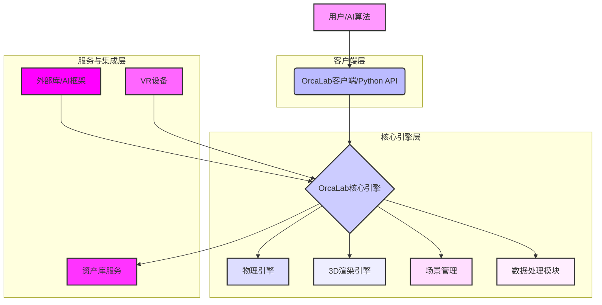

# OrcaLab的技术架构是什么样的？

## 问题
OrcaLab作为一款高保真物理AI仿真系统，其底层技术架构是如何设计和实现的？

## 回答

OrcaLab的技术架构旨在提供一个**高性能、模块化、可扩展且易于使用**的机器人AI仿真平台。它融合了物理引擎、3D渲染、Python接口和云服务等多个核心组件。

## 📋 核心架构概览

OrcaLab的整体架构可以分为几个主要层次：

## 🚀 主要技术组件

### 1. **物理引擎 (Physics Engine)**
- **功能**：提供高保真的物理模拟，包括刚体动力学、碰撞检测与响应、摩擦、重力、关节约束等。
- **特性**：
  - 精确计算物体受力后的运动轨迹和状态。
  - 支持多线程计算，提高复杂场景的物理模拟效率。
  - 可配置的物理参数（时间步长、迭代次数、接触参数等），以平衡精度与性能。
- **核心优势**：确保仿真结果的真实性和可靠性，为机器人训练提供符合现实世界的物理反馈。

### 2. **3D渲染引擎 (3D Rendering Engine)**
- **功能**：将3D场景、模型、材质和光照渲染成可视化图像，呈现给用户。
- **特性**：
  - 支持PBR（基于物理的渲染），提供逼真的视觉效果。
  - 优化渲染管线，利用GPU加速，实现实时高帧率显示。
  - 多通道渲染，支持生成深度图、法线图、语义分割等AI训练所需数据。
- **核心优势**：提供直观的仿真环境可视化，帮助用户理解和调试仿真过程。

### 3. **场景管理模块 (Scene Management)**
- **功能**：管理仿真场景中的所有3D物体、光照、相机、粒子效果等元素，以及它们的层级关系和属性。
- **特性**：
  - 基于树状结构的大纲管理器，方便用户浏览和编辑场景层次。
  - 支持资产的实例化、变换（移动、旋转、缩放）和属性修改。
  - 场景的加载、保存和序列化。
- **核心优势**：提供灵活的场景构建和编辑能力，简化仿真环境的创建。

### 4. **Python API接口 (Python API)**
- **功能**：OrcaLab通过一套Python API（如`orca-gym`库）向外部程序暴露其核心功能，实现与Python脚本的无缝集成。
- **特性**：
  - 提供对仿真环境的控制：加载场景、添加物体、设置物理参数、执行动作等。
  - 提供对仿真状态的访问：获取机器人关节状态、传感器读数、物体位置姿态等。
  - 支持事件监听和回调机制。
- **核心优势**：极大地方便了AI算法的开发和集成，尤其是强化学习和数据采集。

### 5. **数据处理模块 (Data Processing)**
- **功能**：支持仿真过程中生成数据的采集、增广、清洗和存储。
- **特性**：
  - VR遥操作数据采集：记录人类操作数据。
  - 随机化（Domain Randomization）：通过随机改变场景参数（如光照、纹理、物体位置）来生成多样性数据，提高AI模型的泛化能力。
  - 数据格式转换：将仿真数据转换为常见的AI训练数据格式。
- **核心优势**：为AI模型训练提供高质量、多样化的大规模数据集。

### 6. **资产库服务 (Asset Library Service)**
- **功能**：提供在线的3D资产存储、搜索、订阅和管理服务。
- **特性**：
  - 包含工业、生活、机器人等六大类丰富资产。
  - AI生成工具（文生3D、图生3D）：通过AI技术快速创建自定义资产。
  - 资产包管理：以资产包为单位进行订阅和同步。
- **核心优势**：降低用户获取高质量3D资产的成本和时间，加速场景搭建。

### 7. **外部AI框架集成 (External AI Frameworks)**
- **功能**：OrcaLab通过Python API支持与主流AI框架（如PyTorch, TensorFlow）和强化学习库（如Stable-Baselines3）的集成。
- **特性**：
  - 允许用户在OrcaLab仿真环境中运行和训练AI模型。
  - 利用OrcaLab生成的数据进行模型训练和验证。
- **核心优势**：为机器人AI算法的研发和测试提供了一个完整的解决方案。

## 🌐 部署与运行环境

### 1. **客户端应用**
- OrcaLab客户端是一个独立的桌面应用程序，提供图形化界面。
- 主要运行在Ubuntu Linux系统上。

### 2. **Python环境**
- 基于Miniconda管理Python环境，确保依赖隔离。
- 使用Python 3.12版本。

### 3. **GPU加速**
- 深度优化以利用NVIDIA RTX系列显卡的GPU并行计算能力，加速物理模拟和渲染。

### 4. **模块化设计**
- 各组件之间通过明确的接口进行通信，方便扩展和维护。
- 允许用户替换或定制特定模块。

## 📝 总结

OrcaLab的技术架构是一个**多层、多组件协同工作**的系统，旨在为用户提供**易用、高效、高保真的机器人AI仿真体验**。其核心在于强大的物理与渲染引擎、灵活的Python编程接口和智能的资产管理服务，共同构建了一个完整的机器人AI训练和验证平台。

## 相关链接
- [OrcaLab产品简要介绍](OrcaLab简介/OrcaLab%20产品简要介绍_v1.0.md)
- [OrcaLab安装指南](环境准备/Ubuntu系统安装OrcaLab指南_v1.0.md)