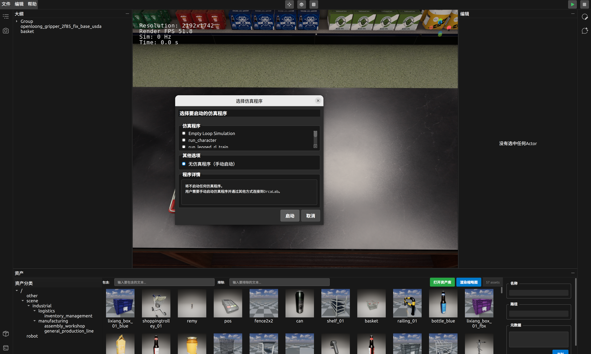

# 无仿真程序（手动启动）是什么意思？

## 问题
在OrcaLab启动仿真时，"无仿真程序（手动启动）"选项是什么意思？它适用于哪些场景？

## 回答

**"无仿真程序（手动启动）"** 是OrcaLab启动仿真时的一个重要选项，意味着OrcaLab客户端会启动3D仿真环境，但**不会自动加载并运行任何外部的Python仿真脚本**。此时，用户需要通过图形用户界面（GUI）或外部连接来手动控制场景。

## 📋 概念解析

### 核心含义
- **无脚本运行**：不执行`.orcalab/config.toml`中配置的任何`external_programs`。
- **手动控制**：所有场景内的物体交互、操作行为都由用户通过客户端界面（鼠标、键盘）或外部程序（例如VR遥操作脚本）进行。

### 区别对比

| 特性对比 | 无仿真程序（手动启动） | 预定义/自定义仿真程序 |
|---------|-----------------------|-------------------------|
| **脚本控制** | 无脚本自动执行 | 有脚本自动执行逻辑 |
| **交互方式** | 纯GUI或外部指令驱动 | 脚本驱动 + GUI辅助 |
| **任务性质** | 探索、编辑、调试 | 自动化任务、AI训练、数据采集 |
| **适用阶段** | 场景搭建、初步测试 | 任务执行、算法验证 |

## 🎯 适用场景

"无仿真程序（手动启动）"模式在OrcaLab的开发和调试阶段非常有用，主要适用于以下场景：

### 1. **场景搭建与编辑**

- **目的**：从零开始构建或修改现有仿真场景。
- **操作**：
  - 通过资产库拖拽添加3D模型。
  - 使用界面上的移动、旋转、缩放工具调整物体位置、姿态和大小。
  - 创建和管理场景中的层级结构。
- **优势**：可以在没有任何脚本干扰的情况下，自由地布局和调整场景元素。

### 2. **物理效果测试与调试**

- **目的**：验证场景中物体的物理行为，如重力、碰撞、摩擦力等。
- **操作**：
  - 放置物体，观察其自由落体、滚动、滑动等物理反应。
  - 调整物体材质属性，测试不同物理参数的效果。
  - 手动推动或施加力，观察物体响应。
- **优势**：快速迭代和测试物理参数，无需编写代码。

### 3. **VR遥操作数据采集**

- **目的**：通过VR设备实时控制机械臂或其他机器人，进行数据采集。
- **操作流程**：
  1. OrcaLab以"无仿真程序（手动启动）"模式启动，加载含有机械臂的场景。
  2. 在**另一个终端窗口**中，手动运行VR遥操作数据采集脚本（例如`python data_collection_tele.py`）。
  3. 该脚本会连接到OrcaLab环境，并将VR手柄的输入转换为机器人控制指令。
  4. 用户佩戴VR设备，通过手柄控制机器人，同时脚本采集数据。
- **优势**：实现人机交互的数据生成，获取真实的操作数据。

### 4. **外部程序接口开发**

- **目的**：开发与OrcaLab交互的外部Python脚本或程序。
- **操作**：
  - OrcaLab作为后端仿真器运行在"无仿真程序（手动启动）"模式。
  - 外部脚本通过OrcaLab提供的API接口，发送控制指令、获取仿真状态。
- **优势**：将仿真核心与控制逻辑解耦，便于开发和测试独立的控制模块。

### 5. **教学演示与学习**

- **目的**：向初学者展示OrcaLab的基本功能和交互。
- **操作**：
  - 启动一个空场景。
  - 逐步演示如何从资产库添加物体、如何移动旋转缩放。
  - 解释每个UI模块的作用。
- **优势**：操作直观，易于理解，适合教学入门。

## 💡 使用建议与注意事项

### 何时选择此模式
- 当您只关注场景的视觉效果和布局时。
- 当您需要手动调整物理世界中的物体时。
- 当您使用外部脚本（如VR遥操作脚本）连接OrcaLab时。
- 当您希望OrcaLab只作为一个3D渲染和物理模拟的后端时。

### 操作要点
- **充分利用GUI工具**：熟练使用移动、旋转、缩放等工具。
- **键盘快捷键**：掌握视图控制（W/A/S/D、右键+Z聚焦）等快捷键。
- **大纲栏**：利用大纲栏进行物体选择、层级管理。
- **编辑栏**：通过编辑栏精确调整物体的Transform属性。

### 外部脚本连接
- 如果您的外部脚本需要连接OrcaLab，请确保您的脚本中包含了正确的连接逻辑（例如使用`orca-gym`库）。
- 确保外部脚本运行在与OrcaLab相同的Conda环境中，或者能访问OrcaLab所需的Python库。

## ⚠️ 常见问题

### Q: 我在"无仿真程序（手动启动）"模式下，为什么机器人不动？
A: 因为此模式下没有运行任何控制脚本。如果您期望机器人自动运动，您需要加载一个包含机器人控制逻辑的仿真程序，或者通过VR遥操作等外部方式进行控制。

### Q: 如何在"无仿真程序（手动启动）"模式下保存我的场景修改？
A: 您可以通过OrcaLab客户端的"文件"菜单，选择"保存布局"或"另存为"来保存您对场景布局的修改。

### Q: "无仿真程序（手动启动）"模式和"启动OrcaLab"有什么区别？
A: "启动OrcaLab"是启动整个客户端应用程序。"无仿真程序（手动启动）"是客户端启动后选择的一种**仿真运行模式**，它决定了是否同时运行一个外部的Python仿真程序。

理解"无仿真程序（手动启动）"模式能帮助您更灵活地运用OrcaLab进行场景创建、调试和与外部程序的集成。

## 相关链接
- [OrcaLab基础操作指南](操作指南/OrcaLab基础操作指南_v1.0.md)
- [如何启动仿真](FAQ-list/076-如何启动仿真.md)
- [VR遥操作与数据采集操作指南](操作指南/数据采集与合成/VR遥操作与数据采集操作指南.md)