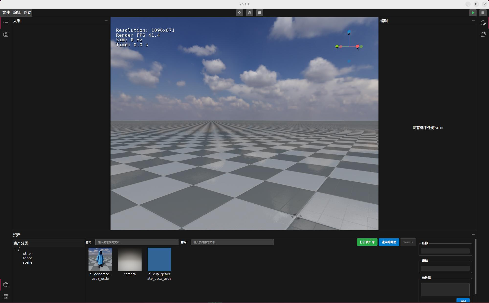
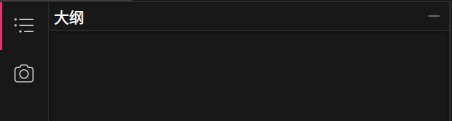
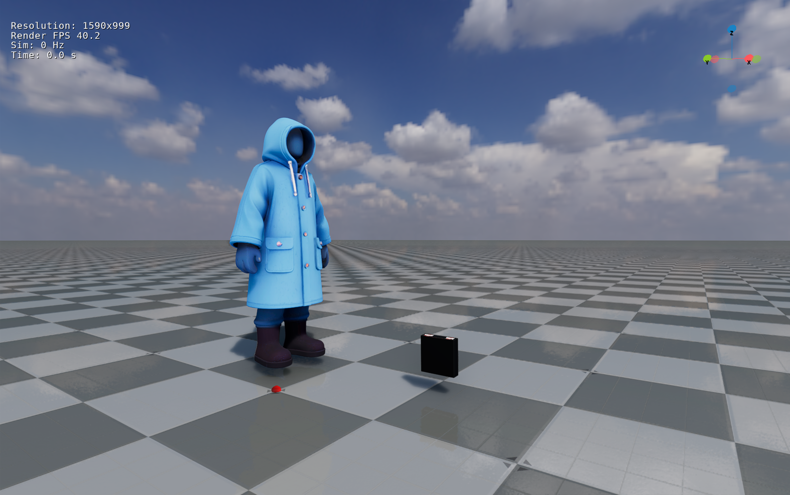
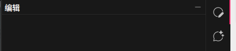
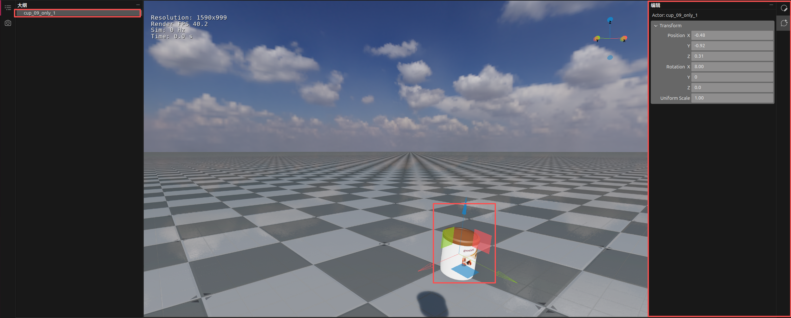

# OrcaLab基础操作指南

## 启动
```bash
##任意位置打开终端，切换至conda环境：*

conda activate orcalab

##启动orcalab客户端*

orcalab
```


启动后，会出现【正在同步资产包...】提示，会自动同步新订阅的资产包以及更新已订阅资产包。

资产包同步完成后出现场景与布局选择界面，点击选择场景、布局后，点击【打开】按钮进入orcalab客户端界面。点击【取消】按钮或【ESC键】后，终端退出orcalab启动程序。

 


默认可选择的场景有orcalab\_day（白天）、orcalab\_night（夜晚）、previewthumbnail\_orcalab（缩略图渲染）。关于更多场景用户可在资产库中订阅后，可查看选择。

布局选项中，【加载默认布局】【空白布局】对于三个默认场景无区别。对于用户在资产库中自行订阅的场景，【加载默认布局】选项【空白布局】选项相比，无场景中自带的可交互物体，需自行添加。

 

 


## GUI界面

启动OrcaSim应用程序，启动后端应用程序界面如下所示，由于OrcaSim

可以支持灵活布局。默认布局分上、中、下三层，共五个模块，分别是菜单栏、大纲栏、视图栏、编辑栏、资产栏。


### 菜单

顶部中间【26.1.2】用于显示orcalab版本号，左侧三个符号依次是隐藏、最大化、关闭。

下层左侧依次是文件、编辑、帮助，中部依次是【移动】、【旋转】、【缩放】功能按钮，右侧依次是【仿真运行】、【停止仿真运行】按钮。


<table>
<tbody>
<tr class="odd">
<td>菜单栏</td>
<td>功能</td>
<td></td>
<td>快捷键</td>
<td></td>
</tr>
<tr class="even">
<td></td>
<td>显示版本号与场景布局名称</td>
<td></td>
<td>--</td>
<td></td>
</tr>
<tr class="odd">
<td></td>
<td>隐藏</td>
<td></td>
<td>--</td>
<td></td>
</tr>
<tr class="even">
<td></td>
<td>最大化</td>
<td></td>
<td>--</td>
<td></td>
</tr>
<tr class="odd">
<td></td>
<td>关闭</td>
<td></td>
<td>--</td>
<td></td>
</tr>
<tr class="even">
<td></td>
<td>打开布局</td>
<td>可选择本地保存在布局文件</td>
<td>ctrl+o</td>
</tr>
<tr class="odd">
<td></td>
<td>保存布局</td>
<td>保存编辑的布局文件</td>
<td>ctrl+s</td>
</tr>
<tr class="even">
<td></td>
<td>另存为</td>
<td>另存编辑的布局文件</td>
<td>ctrl+shift+s</td>
</tr>
<tr class="odd">
<td></td>
<td>新建布局</td>
<td>新建布局文件</td>
<td>ctrl+n</td>
</tr>
<tr class="even">
<td></td>
<td>退出</td>
<td>退出程序</td>
<td></td>
</tr>
<tr class="odd">
<td></td>
<td>undo</td>
<td>撤销</td>
<td>ctrl+z</td>
</tr>
<tr class="even">
<td></td>
<td>redo</td>
<td>取消撤销</td>
<td>ctrl+shift+z</td>
</tr>
<tr class="odd">
<td></td>
<td>关于OrcaLab</td>
<td><p>显示OrcaLab的版本、版权所有、公司主页、GitHub</p>
<p>仓库等信息</p></td>
<td>--</td>
</tr>
<tr class="even">
<td></td>
<td>移动</td>
<td>支持对选中物体进行X、Y、Z三个方向的移动</td>
<td>1</td>
</tr>
<tr class="odd">
<td></td>
<td>旋转</td>
<td>支持对选中物体进行X、Y、Z三个方向的旋转</td>
<td>2</td>
</tr>
<tr class="even">
<td></td>
<td>缩放</td>
<td>支持对选中物体以物体中心点为中心进行缩放</td>
<td>3</td>
</tr>
<tr class="odd">
<td></td>
<td>仿真运行</td>
<td></td>
<td>--</td>
<td></td>
</tr>
<tr class="even">
<td></td>
<td>结束仿真运行</td>
<td></td>e
<td>--</td>
<td></td>
</tr>
</tbody>
</table>


### 大纲与相机

该模块主要用于管理视图布局中的物品与视角。最左侧按钮用于切换【大纲】【相机】，其中【大纲】用于管理视图布局中的物品与相机，【相机】用于切换视图视角。




通过从资产库中拖拽资产至视图模块，添加物品和相机。添加至视图中的物品和相机同时会出现在【大纲】列表中。涉及功能操作如下：

|    |        |                                   |                                    |
| -- | ------ | --------------------------------- | ---------------------------------- |
| 模块 | 功能     | 操作                                |                                    |
| 大纲 | 资产管理   | 添加群组                              | 方式一：大纲空白处鼠标右键-【Add Group】          |
|    |        |                                   | 方式二：大纲列表中任一资产鼠标右键-【Add Group】      |
|    |        | 资产删除                              | 方式一：大纲列表中想要删除资产/群组鼠标右键-【Delete】    |
|    |        |                                   | 方式一：大纲列表中想要删除资产/群组鼠标左键-点击键盘Delete键 |
|    |        | 资产重命名                             | 大纲列表中想要重命名资产/群组鼠标右键-【Rename】       |
| 相机 | 视图视角切换 | 在相机列表中点击可切换视图栏场景布局中默认相机与自添加相机的视角。 |                                    |
|    |        |                                   |                                    |


### 视图

用于展示场景布局展示。



在3D视图中配合键盘和鼠标操作，可实现对3D环境的查看和导航，如下是常见的快捷键。

|      |            |                         |
| --   | -----------| ------------------------|
| 序号  | 功能描述  | 快捷键  |
| 1    | 视角前进  | 右键+w  |
| 2    | 视角后退  | 右键+s  | 
| 3    | 视角左移  | 右键+a  |                          
| 4    | 视角右移  | 右键+d  | 
| 5    | 视角下移  | 右键+e  | 
| 6    | 视角上移  | 右键+q  | 
| 7    | 视角旋转  | 鼠标右键  |
| 8    | 点选物体  | 鼠标左键 | 
| 9    | 移动物体  | 1      |                          
| 10    | 旋转物体  | 2     | 
| 11    | 缩放物体  | 3     | 
| 12    | 仿真模式下改变物品位置后，再次运行仿真程序  | F3  | 


如果要近距离查看在3D视图中的某个物体，可以在大纲中的树状菜单中，点击该节点，或者直接在视图中左键选中该物体，使用"右键+z"，切换到该对象。

### 编辑

该模块主要有编辑两个功能，【编辑】主要负责资产Transform属性编辑（Position、Rotation、Uniform
Scale）。




【编辑】功能：在大纲列表或视图中选中资产，右侧【编辑栏】会显示该物品的Transform信息，包含Position、Rotation、Uniform
Scale，可点击直接输入数字进行精确修改，同时也可通过滑动在鼠标移至数据条时出现的箭头进行相关参数的调整。




### 资产与终端

该模块主要有资产、终端两个功能，【资产】主要展示已在资产库中订阅成功的资产，【终端】主要展示仿真运行的进程。


【资产】功能：展示已订阅资产。支持对已定阅资产进行包含、排除相应字段的模糊搜索。点击【打开资产库】按钮，可打开资产库。鼠标移至某个物品上时，最右侧会显示该物品的名称、路径、元数据等相关信息，并且可点击下方【复制】按钮，实现这些信息的复制。

【终端】主要展示仿真运行的进程与结果，可将仿真运行的进程与结果进行清空与复制。
