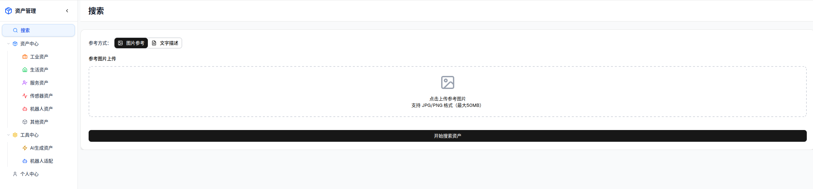
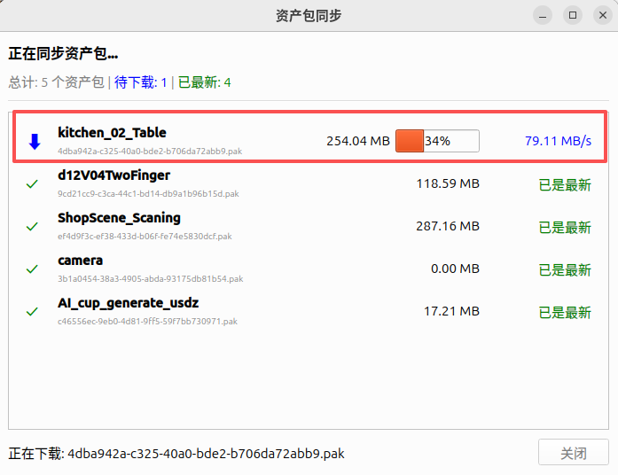
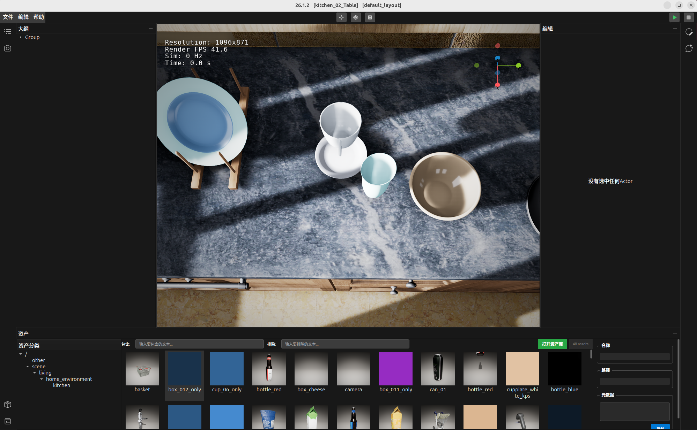
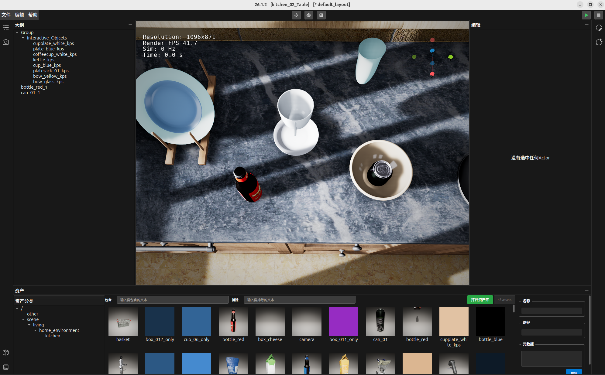
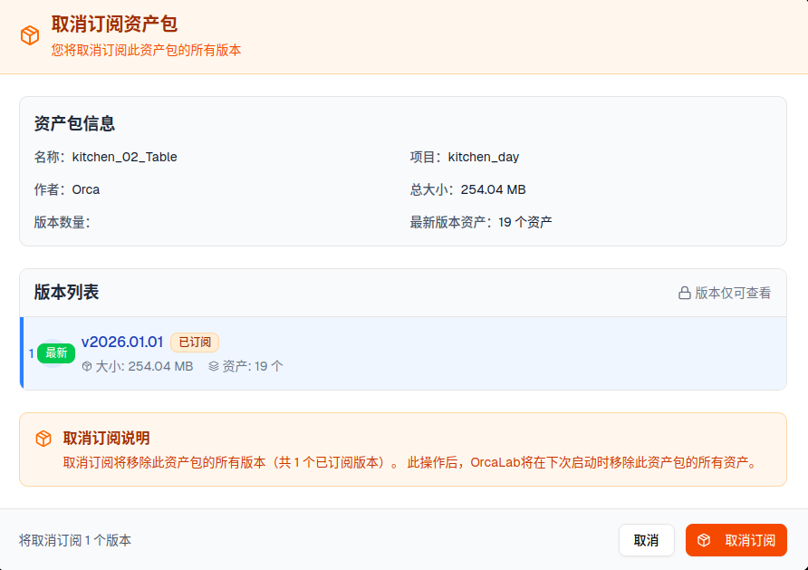
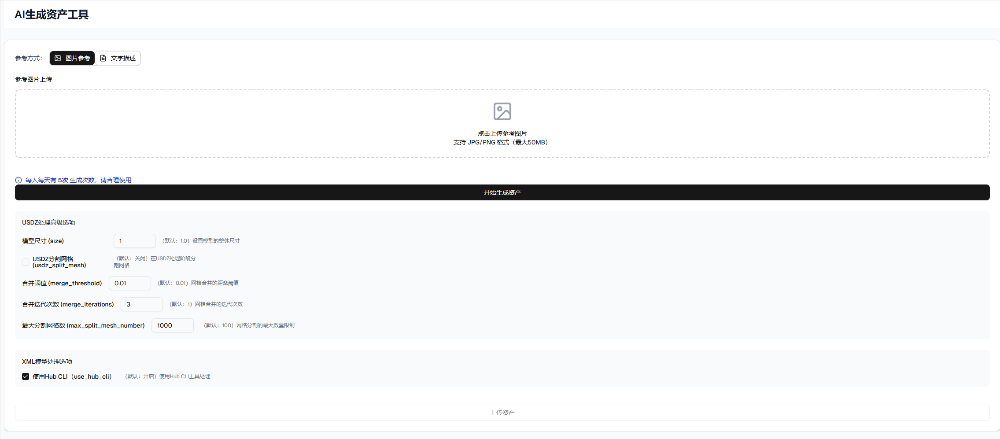
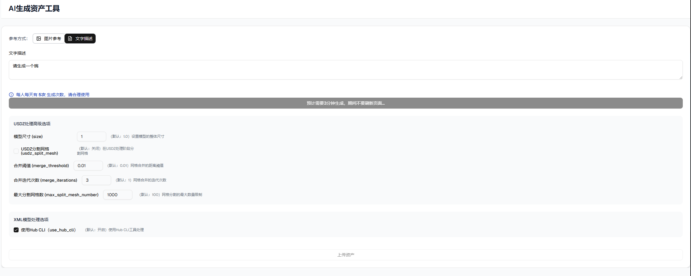
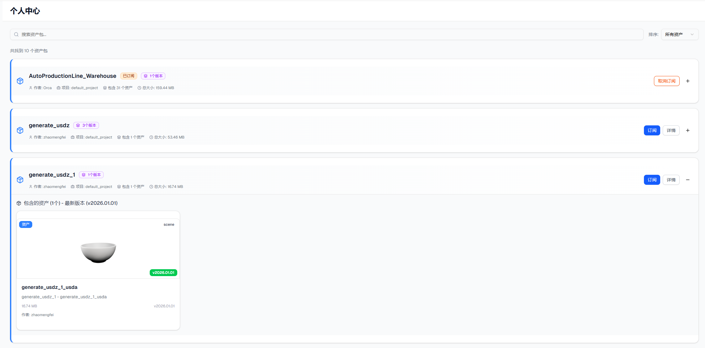

# 资产库基础操作指南


## 页面介绍

下载安装好OrcaLab客户端，点击【打开资产库】按钮后，弹出资产库管理网页，该网页左侧为资产管理标签栏、右侧为内容栏。

 ```bash
  # 1. 进入OrcaLab conda 环境

  conda activate orcalab

  #  重新进入 OrcaLab

  orcalab
  ```


### 资产管理
- 搜索：支持对资产中心的所有资产进行图片参考或文字描述两种方式搜索。
- 资产中心：有工业资产、生活资产、服务资产、传感器资产、机器人资产、其他资产6种分类。
- 工具中心：有AI生成资产、机器人适配2种工具。
- 个人中心：已订阅资产。
- 账号管理：账号信息查看与登出。
### 内容
- 展示资产管理中各标签内容。


## 功能介绍

### 搜索
提供参考图片、文字描述两种搜索方式。




### 资产中心
共有工业资产、生活资产、服务资产、传感器资产、机器人资产、其他资产6种分类。可在相应类目中查找订阅所需资产。支持通过输入关键字搜索资产包或资产，支持通过按名称、按大小对资产中心的资产把包进行排序。


#### 资产包详情与查看
资产包是1个或多个资产的组合，是资产库订阅的基本单位。资产包中有作者、项目、包含资产数量、总大小等基础信息。
- 【详情】展示资产包基本信息、资产描述、版本说明、包含的资产文件，可进行【订阅/取消订阅】、【返回草稿箱】、【删除】等操作，其中【返回草稿箱】、【删除】仅限作者是该账号的资产包。

  

- 【**+**】展示该资产包中的资产。【**-**】收起该资产包中的资产。


#### 资产订阅与使用
【订阅】可将资产包下载至本地OrcaLab资产文件目录中。订阅后，OrcaLab将在下次启动时自动下载并更新该版本的资产。在重启后的OrcaLab下方【资产库】中出现，即可进行使用。订阅后的资产包也会同步至个人中心。

- 第一步：订阅资产：在资产库中订阅资产。


- 第二步：使用订阅资产：重启OrcaLab使用资产

 ```bash
  # 1. 进入OrcaLab conda 环境

  conda activate orcalab

  #  重新进入 OrcaLab

  orcalab
  ```
   重启OrcaLab，【正在同步资产包...】中，下载新订阅的资产包，并同步更新已订阅的资产包。订阅带【有场景】标签的资产包，资产包中的资产自带布局，同步资产完成后，可在下一步【选择场景】列表中出现，使用【加载默认布局】，可在视图中打开查看该资产包中的资产场景布局，可修改默认场景布局或从客户端下方资产列表中的资产拖入视图中，改变后的布局可通过【文件-保存布局】。
   
    

    
 
- 【取消订阅】取消已订阅的资产包，取消后个人中心以及在重启后的OrcaLab下方【资产库】中的会同步消失。

 

### 工具中心

#### AI生成资产工具

**生成资产**
支持通过【图片参考】【文字描述】两种方式生成USDZ格式3D资产。目前每个用户每天两种方式有5次使用机会。

 

参数介绍【基本保持默认】：
- 分离Mesh：将一个模型的网格拆分成多个独立的模型文件或资产
- 自动生成LOD：自动为模型生成多层次细节网格。
- 平滑Mesh：对模型的网格表面进行平滑处理。
- 平滑强度：控制“平滑Mesh”处理的程度。两者配套
- 使用Hub CLI：指定使用Hub命令行工具来处理模型即ap处理。

上传参考图片或文字描述，点击【开始生成资产】，生成期间，不可刷新页面，即可得到3D资产。

 


**上传资产**

点击下方【上传资产】，将生成的资产上传至个人中心，并可订阅该资产，在OrcaLab中使用





### 账号管理

账号管理支持进行账号信息查看与账号退出。

点击【账号名】可查看账号信息，进行绑定第三方账号等操作；点击【退出】按钮，可实现账号退出登录。


