# 资产库基础操作指南


## 页面介绍

下载安装好OrcaLab客户端，点击【打开资产库】按钮后，弹出资产库管理网页，该网页左侧为资产管理标签栏、右侧为内容栏。

 ```bash
  # 1. 进入OrcaLab conda 环境

  conda activate orcalab

  #  重新进入 OrcaLab

  orcalab
  ```
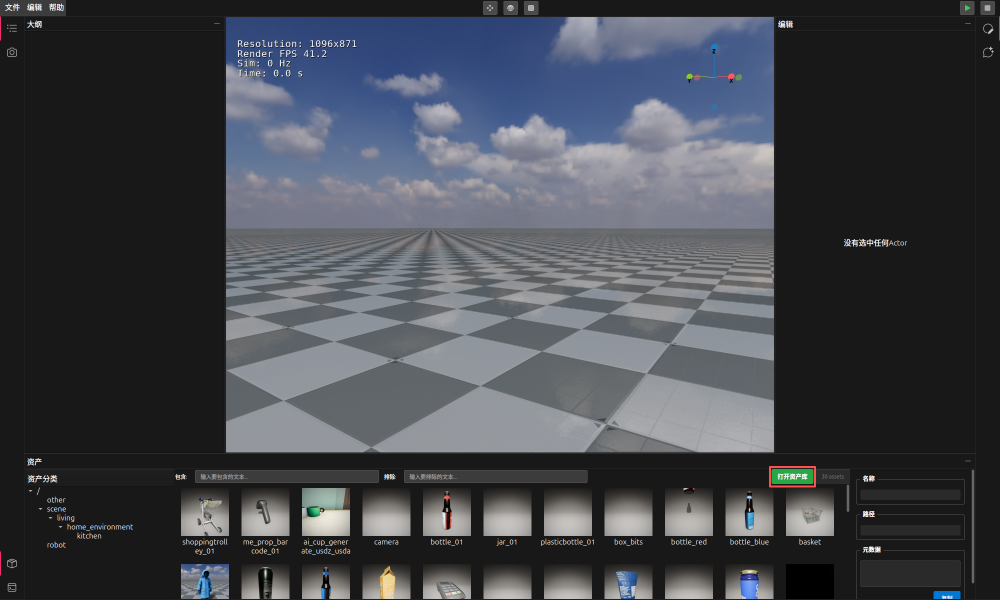
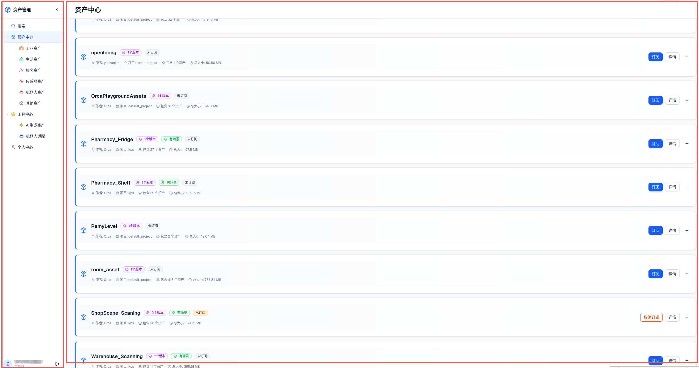


### 资产管理
- 搜索：支持对资产中心的所有资产进行图片参考或文字描述两种方式搜索。
- 资产中心：有工业资产、生活资产、服务资产、传感器资产、机器人资产、其他资产6种分类。
- 工具中心：有AI生成资产、机器人适配2种工具。
- 个人中心：已订阅资产。
- 账号管理：账号信息查看与登出。
### 内容
- 展示资产管理中各标签内容。


## 功能介绍

### 搜索
提供参考图片、文字描述两种搜索方式。

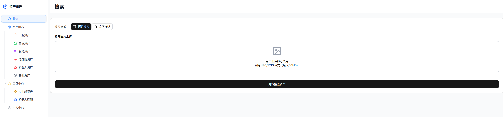
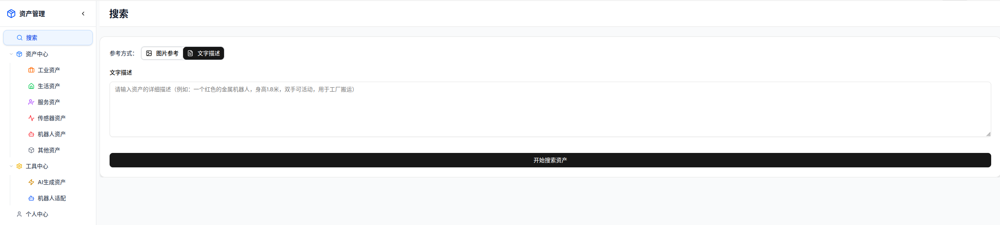

### 资产中心
共有工业资产、生活资产、服务资产、传感器资产、机器人资产、其他资产6种分类。可在相应类目中查找订阅所需资产。支持通过输入关键字搜索资产包或资产，支持通过按名称、按大小对资产中心的资产把包进行排序。

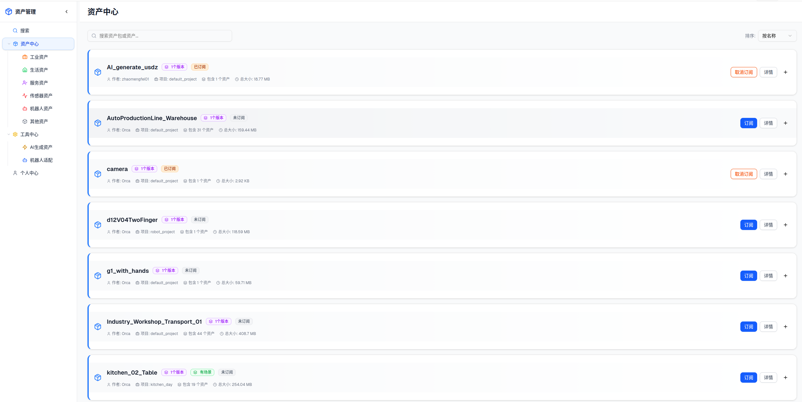

#### 资产包详情与查看
资产包是1个或多个资产的组合，是资产库订阅的基本单位。资产包中有作者、项目、包含资产数量、总大小等基础信息。
- 【详情】展示资产包基本信息、资产描述、版本说明、包含的资产文件，可进行【订阅/取消订阅】、【返回草稿箱】、【删除】等操作，其中【返回草稿箱】、【删除】仅限作者是该账号的资产包。

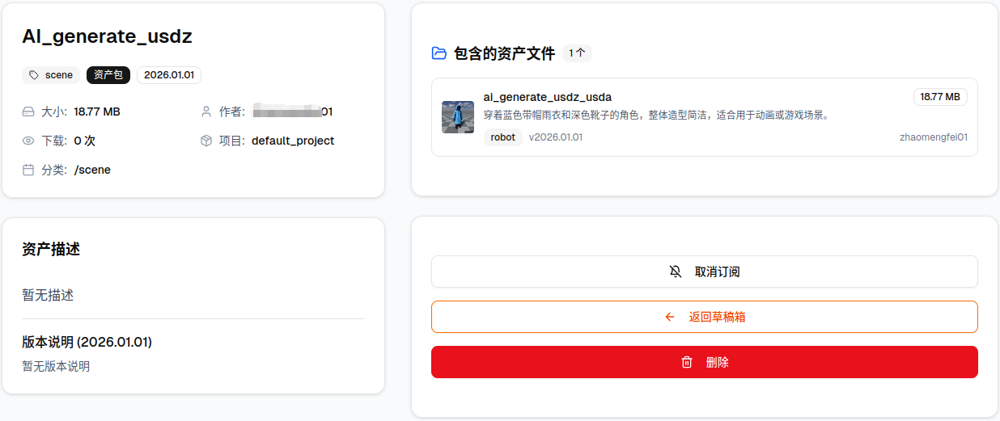 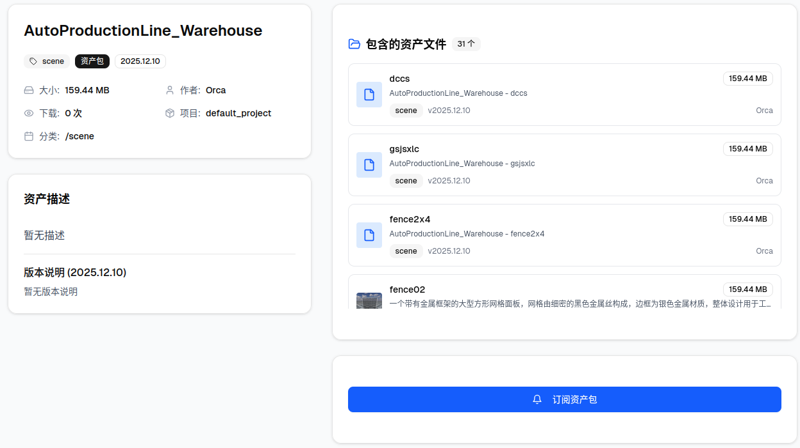 

- 【**+**】展示该资产包中的资产。【**-**】收起该资产包中的资产。

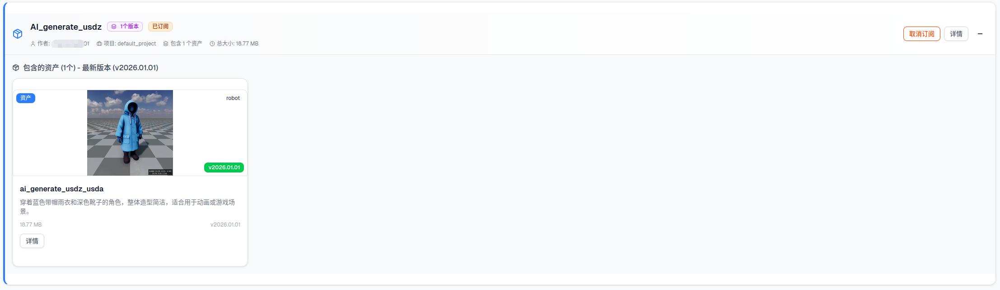

#### 资产订阅与使用
【订阅】可将资产包下载至本地OrcaLab资产文件目录中。订阅后，OrcaLab将在下次启动时自动下载并更新该版本的资产。在重启后的OrcaLab下方【资产库】中出现，即可进行使用。订阅后的资产包也会同步至个人中心。

- 第一步：订阅资产：在资产库中订阅资产。

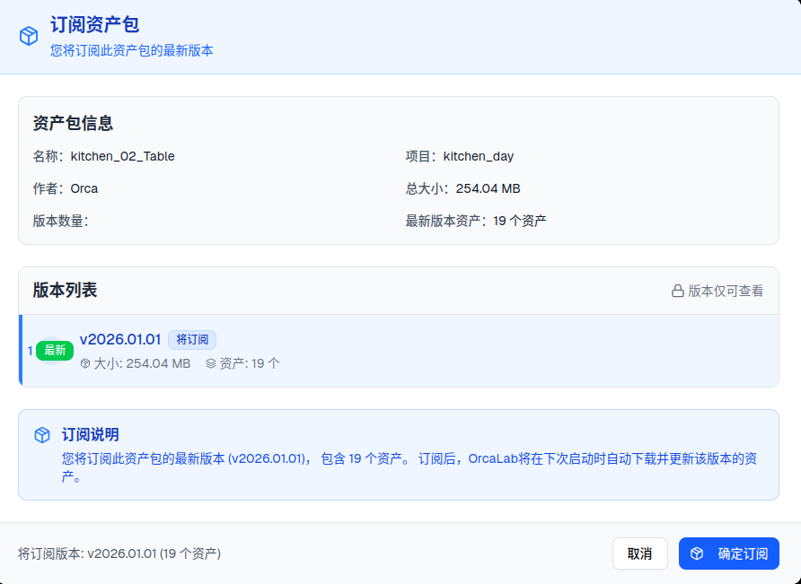

- 第二步：使用订阅资产：重启OrcaLab使用资产

 ```bash
  # 1. 进入OrcaLab conda 环境

  conda activate orcalab

  #  重新进入 OrcaLab

  orcalab
  ```
   重启OrcaLab，【正在同步资产包...】中，下载新订阅的资产包，并同步更新已订阅的资产包。订阅带【有场景】标签的资产包，资产包中的资产自带布局，同步资产完成后，可在下一步【选择场景】列表中出现，使用【加载默认布局】，可在视图中打开查看该资产包中的资产场景布局，可修改默认场景布局或从客户端下方资产列表中的资产拖入视图中，改变后的布局可通过【文件-保存布局】。
   
   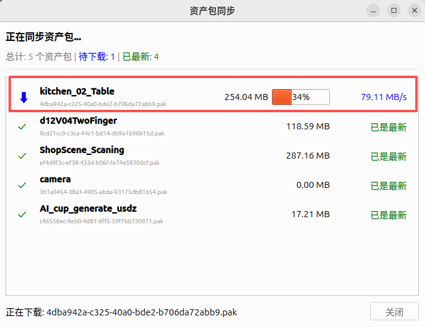 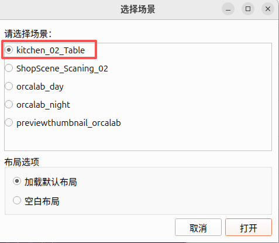

   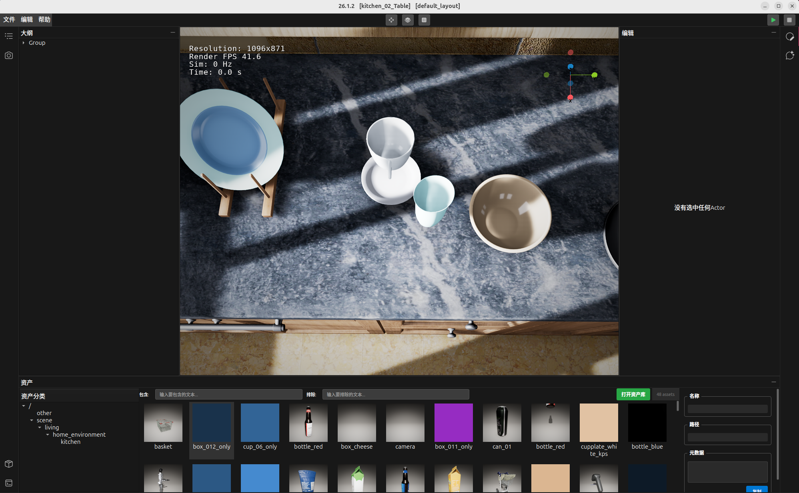 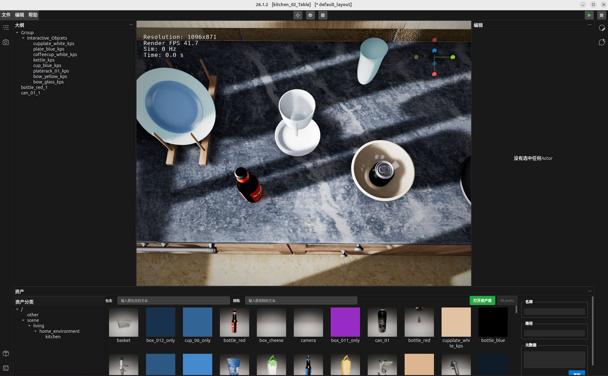
 
- 【取消订阅】取消已订阅的资产包，取消后个人中心以及在重启后的OrcaLab下方【资产库】中的会同步消失。

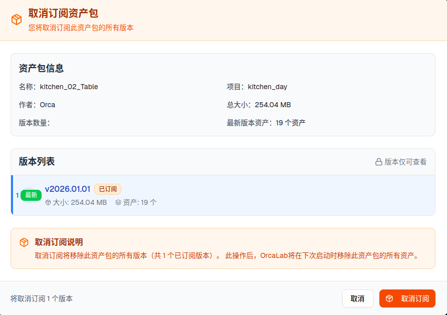 

### 工具中心

#### AI生成资产工具

**生成资产**
支持通过【图片参考】【文字描述】两种方式生成USDZ格式3D资产。目前每个用户每天两种方式共有5次使用机会。

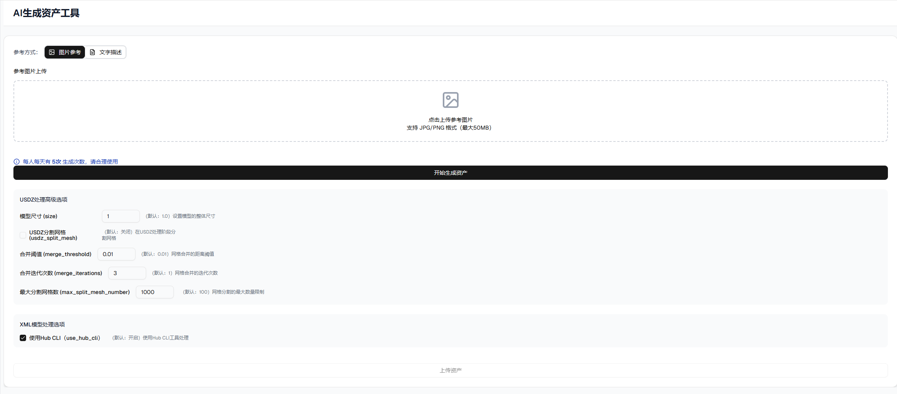 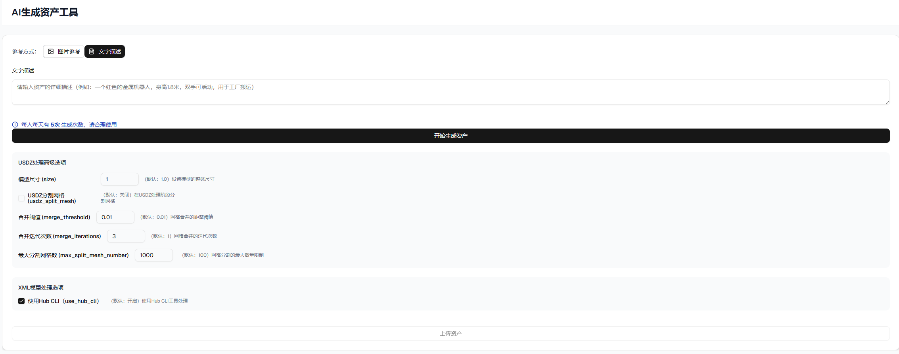

参数介绍【基本保持默认】：
- 分离Mesh：将一个模型的网格拆分成多个独立的模型文件或资产
- 自动生成LOD：自动为模型生成多层次细节网格。
- 平滑Mesh：对模型的网格表面进行平滑处理。
- 平滑强度：控制“平滑Mesh”处理的程度。两者配套
- 使用Hub CLI：指定使用Hub命令行工具来处理模型即ap处理。

上传参考图片或文字描述，点击【开始生成资产】，生成期间，不可刷新页面，即可得到3D资产。

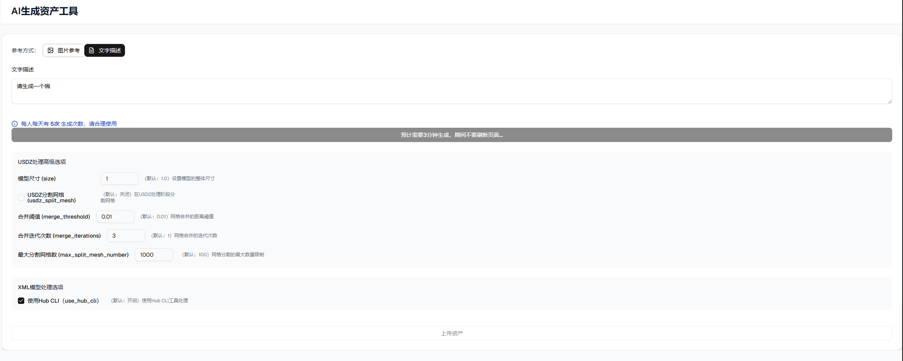 

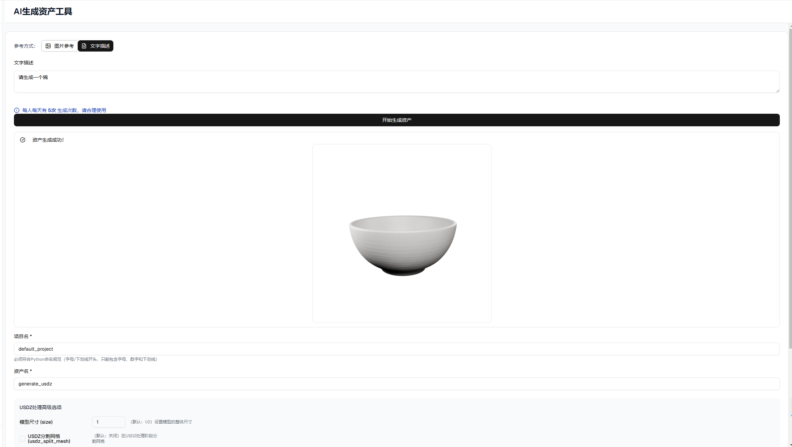


**上传资产**

点击下方【上传资产】，将生成的资产上传至个人中心，并可订阅该资产，在OrcaLab中使用

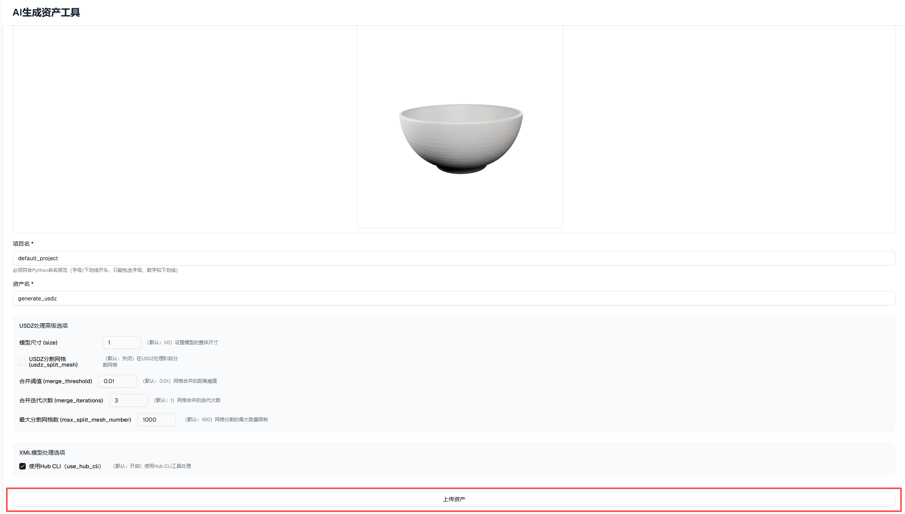

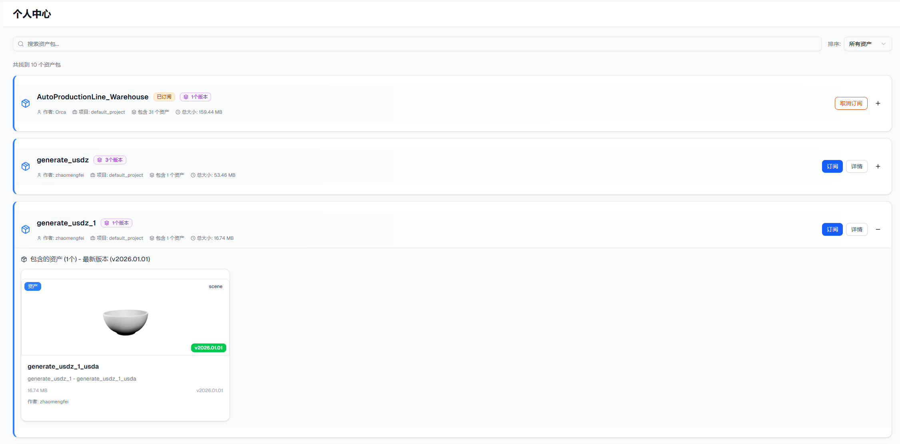

#### 机器人适配工具

为解决用户在使用ORCA物理AI仿真平台时，需将机器人URDF模型转为MJCF，并进行步骤较为繁复且较为专业的适配工作后，才能顺利在ORCA物理AI仿真平台进行遥操数据采集、数据增广等工作。该过程操作繁复、耗时长，且工作流不可复用。因此，开发此工具，简化适配操作流程、提高机器人适配工作工作效率，使得用户可以快速上手，在平台中顺利进行机器人后续操作训练任务。该工具不仅可解决机器人URDF模型转为MJCF中遇到的material 材质名为空、取值范围错误等问题，还可以为机器人关节自动配置position、motor驱动器。

**页面布局**

从左至右分别是历史记录、工具栏、结果展示栏。

- 历史记录：保存展示用户导入修改的机器人模型与响应参数修改。【鼠标右键】可进行重命名和删除操作。
- 工具栏：用于上传URDF/MJCF文件夹、展示机器人的基础信息、可进行属性调整、以及结果输出等操作。
- 结果展示栏：展示导入的机器人。①视角操作：鼠标左键-视角旋转，shift+鼠标左键-视角平移，鼠标滚轮-视角缩放。②仿真运行：点击【运行】可运行仿真，通过Control控制机器人，【重置】可实现Control参数重置归零。


  

**上传文件**

支持点击上传或拖拽上传机器人模型URDF/MJCF文件夹或压缩包。

**基础信息**

- 机器人名称：自动识别填充机器人名称。
- 移动方式：必选，双足/底盘。
- 操作末端：必选，夹爪/灵巧手。

**属性调整**

**机器人结构**：
展示机器人树状结构，可删除、编辑关节；可新增、编辑、删除驱动器。


**材质配置**
- AI全局材质配置：根据AI推荐，一键更换材质。
- 局部材质配置：鼠标左键双击选择部位，可调整材质类型（塑料、金属、木材、橡胶）、基础属性（颜色、金属度、粗糙度）、纹理贴图。

  


**动力学配置**

①单关节：可实现对关节AI分类，并自动为关节添加执行器。

点击分类可根据基础信息中所选的移动方式、操作末端类型，对关节所属部位进行自动分类，并自动为关节添加position、motor执行器。若认为某关节分类不正确，可鼠标左键长按该条数据，将其拖至上方选定的类型中即可。点击【编辑】，跳转至【机器人结构】中，可对所选关节和执行器参数进行修改。


①并联关节：可创建刚体连接约束、关节联动约束、肌腱等。相应配置是否生效可在右侧运行仿真后，在control列表中查看并进行控制。

- 刚体连接约束：用于创建刚体连接约束，常用于夹爪刚体连接。body1：左键选择；body2：右键选择；anchor:Ctrl+右键选择（越精确连接控制效果越好）。

  

- 关节联动约束：用于创建关节联动约束，常用于夹爪、灵巧手等关节联动。

  

- 肌腱：用于创建肌腱，并为肌腱设置执行器，统一控制联动关节。执行器类型可选择general、position、motor。

  

③排除碰撞：可创建排除碰撞。创建刚体连接约束的部件，自动添加排除碰撞。

  

**初始位姿配置**

可调整关节初始位姿。双击表格即可跳转至机器人结构中，可对相应关节的控制范围等进行调整。

初始位姿保存，支持两种方式二选一。**仅保存至XML**：将调整的位姿保存至XML中，对位姿状态进行永久性修改；**仅保存至数采配置文件**：将调整的位姿初始状态保存到数采配置文件中，用于定义数据采集时的初始姿态，不修改模型的初始状态。

  

**传感器配置**

用于创建、编辑、删除相机传感器。【视图】可查看相机的视线与视框。【编辑】配合基础信息中的坐标轴，平移、旋转功能可实现相机的平移与旋转修改。

  

**其他配置**

创建site，用于标记位置。数据采集配置文件中需获取夹爪或灵巧手抓取的定位点。

  


**结果输出**

- 导出xml：导出修改后的xml文件。

 

- 导出模型：导出整个模型文件。

 

- 上传模型：将模型上传至个人中心，可进行订阅。

 

- 导出配置文件：导出数据采集配置文件，用于数据采集。左右机械臂末端即为【其他配置】中定义的夹爪或灵巧手抓取的标记点site，左右手驱动关节即选择驱动控制的关节。

  


### 账号管理

账号管理支持进行账号信息查看与账号退出。

点击【账号名】可查看账号信息，进行绑定第三方账号等操作；点击【退出】按钮，可实现账号退出登录。

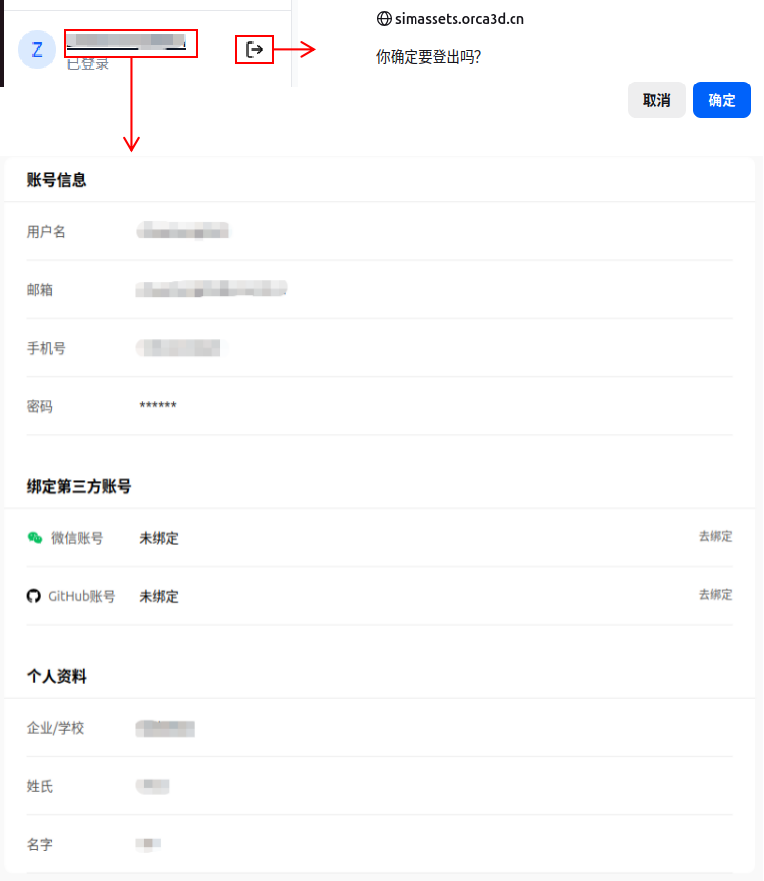


