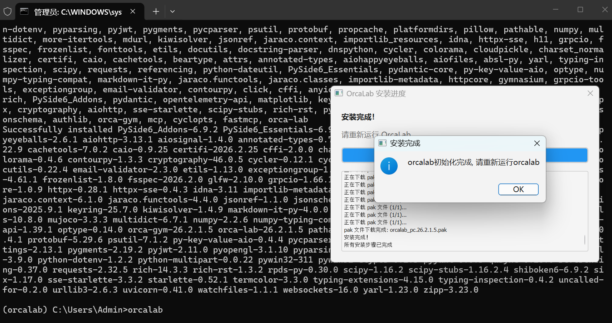
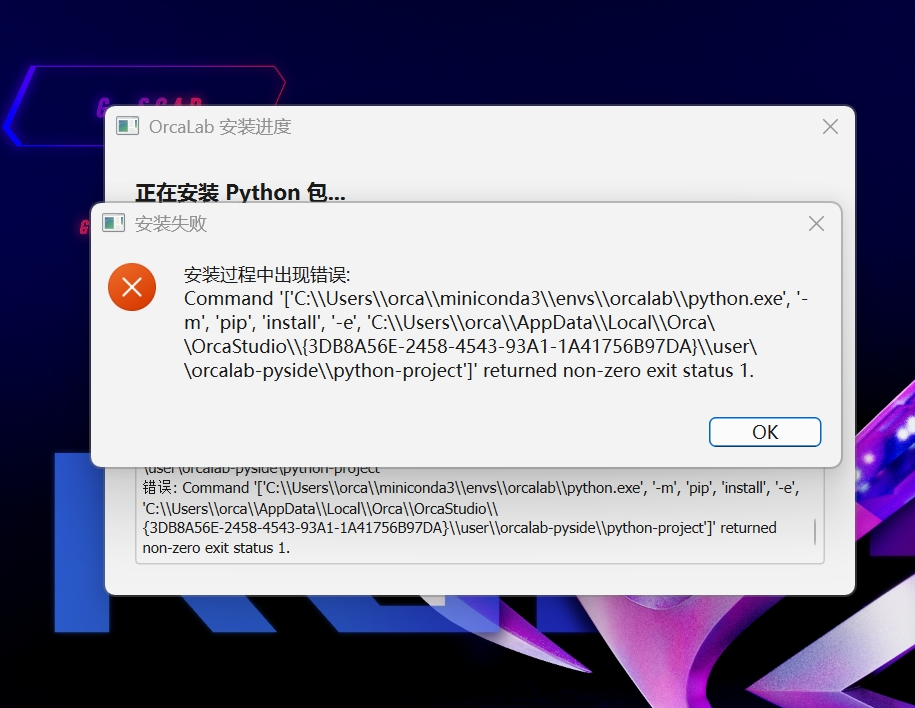
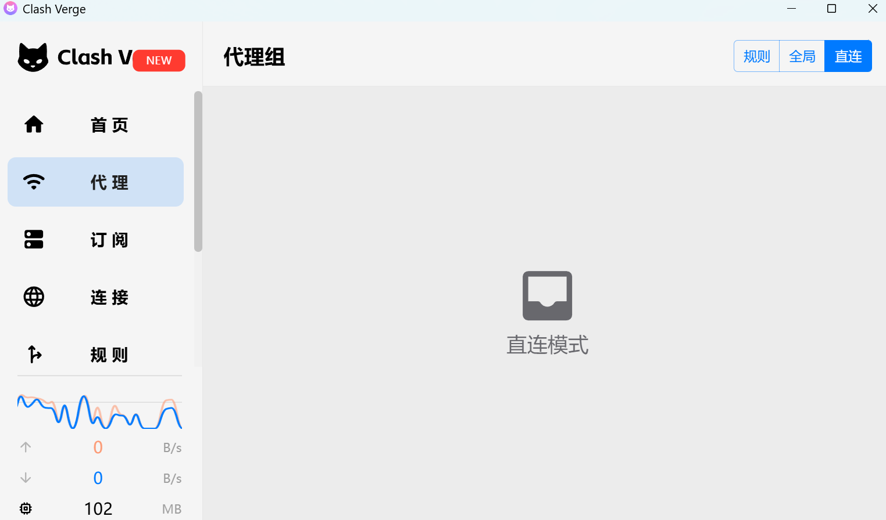
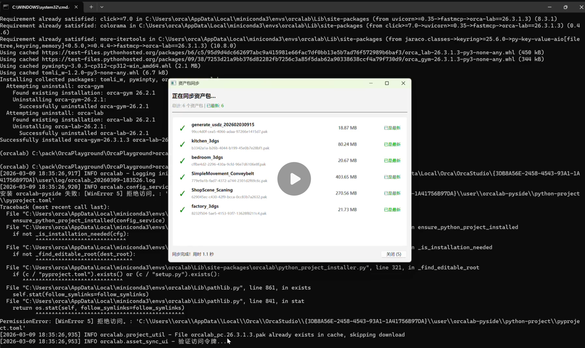
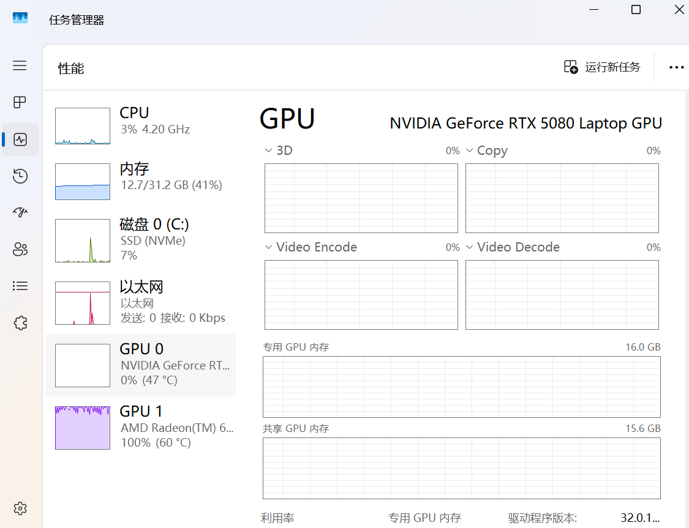
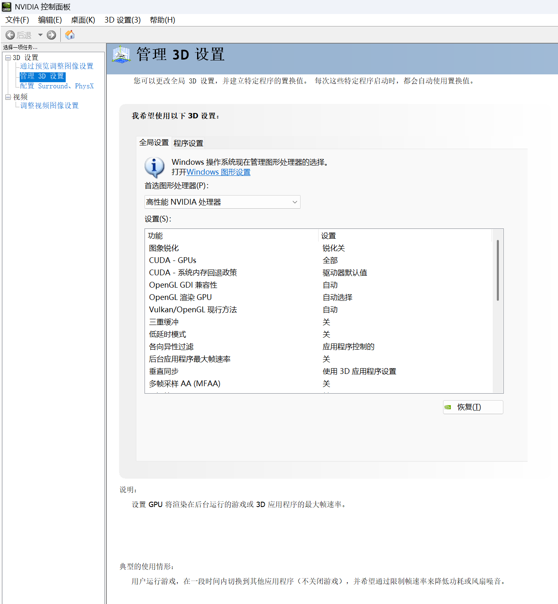

# Windows操作系统上安装OrcaLab

## 一、系统要求

### 1.1 操作系统

- **推荐系统**：Windows 11

### 1.2 前置依赖

- **Miniconda**：需要提前安装最新版本的 Miniconda
- **CMD命令行**：需要以管理员权限启动
- **网络要求**：需要稳定的网络连接
- **用户注册**：参见用户注册与管理章节完成用户注册

### 1.3 硬件要求

- 建议配备 NVIDIA 显卡（RTX 40/50 系列）
- 建议内存：大于32G

### 1.4 ORCALab最新版本号26.4.2
 - 2.4章节安装命令默认下载最新版本，亦可通过指定版本号安装：pip install orca-lab==xx.x.x
---

## 二、安装步骤

### 2.1 安装 Miniconda
**步骤1：** 下载Miniconda安装程序并安装。
```bash
# 下载 Miniconda windows版本安装包
https://www.anaconda.com/download/success
```
**步骤2：** 配置系统环境变量
- 按下 Win + R，输入 sysdm.cpl 并回车，打开「系统属性」窗口； 
- 切换到「高级」选项卡，点击「环境变量」； 
- 在「系统变量」列表中找到 Path，双击打开； 
- 点击「新建」，添加以下Miniconda安装路径（替换成你的实际路径）

```bash
#  Miniconda 安装路径
C:\ProgramData\miniconda3\
C:\ProgramData\miniconda3\Scripts\
```

**步骤3：** 验证配置是否生效（建议CMD命令行以`管理员启动`）
- 关闭所有已打开的命令行窗口
- 重新打开一个新的命令行窗口，输入以下命令：
```bash
# 如果输出 conda x.x.x 之类的版本号，说明配置成功
conda --version
```

### 2.2 配置 PyPI 镜像源

为了加快下载速度，建议配置清华 PyPI 镜像源：

```bash
# 配置清华源
pip config set global.index-url https://pypi.tuna.tsinghua.edu.cn/simple
pip config set install.trusted-host pypi.tuna.tsinghua.edu.cn
```

### 2.3 创建orcalab运行的Conda环境

```bash
# 创建名为 orcalab 的 Python 3.12 环境
conda create -n orcalab python==3.12

# 激活环境
conda activate orcalab
# 激活成功时，括号中显示创建的conda名称 e.g: (orcalab) C:\Users\Admin>
```


### 2.4 安装 OrcaLab

```bash
# 从 PyPI 安装 OrcaLab
pip install orca-lab
#亦可通过指定版本号安装：pip install orca-lab==xx.x.x
#如清华源不稳定，请尝试阿里源https://mirrors.aliyun.com/pypi/simple/  或者 官方源 https://pypi.org/simple/simple/
```

### 2.5 启动 OrcaLab

```bash
# 命令行执行以下命令，首次启动OrcaLab（会自动安装依赖）
orcalab
```


**注意**：

- 首次运行 `OrcaLab` 会自动安装 Python 依赖包
- 第二次运行才会进入软件界面

---

## 三、检查安装环境及版本

安装完成后，可以通过以下方式验证：

```bash
# 1. 检查 Python 环境
python --version  # 应显示 Python 3.12.x

# 2. 检查 OrcaLab 版本
pip show orca-lab

# 3. 启动软件
orcalab
```

--- 
## 四、OrcaLab升级方法
有升级包可用时
```bash
# 需要添加 --upgrade 参数
pip install --upgrade orca-lab
```

---

## 五、OrcaLab卸载方法

如果需要卸载 OrcaLab：

```bash
# 1. 退出 conda 环境
conda deactivate

# 2. 删除 conda 环境
conda env remove -n orcalab
```


---

## 六、常见问题排查

### 6.1 安装问题

#### 6.1.1问题：pip 安装失败，下载速度慢

**解决方案**：

1. 检查网络连接
2. 确认已配置清华 PyPI 镜像源（参考 2.2 节）
3. 验证镜像源是否可用

```bash
# 测试镜像源连接
curl https://pypi.tuna.tsinghua.edu.cn/simple/
```

#### 6.1.2问题：conda 环境激活失败

**解决方案**：

```bash
# 初始化 conda
conda init 

# 关闭所有命令行，重新打开命令行再激活
conda activate orcalab
```
#### 6.1.3问题：首次启动orcalab,安装组件包过程中报错


**解决方案**:
- 检查是否开启了代理，如果开启了代理，将代理关闭或设置为直连。
  


### 6.2 运行问题

#### 6.2.1问题：运行Orcalab, 同步完资产后闪退


**解决方案**：
- 权限问题，检查CMD是否有管理员权限
- 打开CMD命令行时，选择"以管理员身份运行"
  


#### 6.2.2问题：硬件配置有独立显卡，但运行Orcalab非常卡顿，性能监控显示实际运行在集成显卡上


**解决方案**：
- 首选图形处理器设置问题，打开NVIDIA控制面板。
- 在3D设置中奖NVIDIA处理器设置为首选图形处理器
  


#### 6.2.3问题：软件启动后无法连接服务器

**解决方案**：

- 检查网络连接
- 确认防火墙设置
- 使用离线启动模式（如果已下载资产）

  

### 6.2.4 问题：虚拟机上运行ORCA Lab显示帧率低

**解决方案**：
- 由于OrcaLab对显卡的开销比较大，为了提升您的使用体验，远程连接虚拟机推荐使用高性能远程桌面。
- 在您在虚拟机配置好windows或者linux后，推荐使用Sunshine + Moonlight游戏级性能的远程桌面进行连接
- 参考下载链接：https://github.com/moonlight-stream/moonlight-qt/releases/tag/v6.1.0 https://github.com/LizardByte/Sunshine/releases

---

## 七、技术支持

如遇到问题，请：

1. 查看本文档的"常见问题排查"部分
2. 检查终端错误信息
3. 扫码联系技术支持团队


---